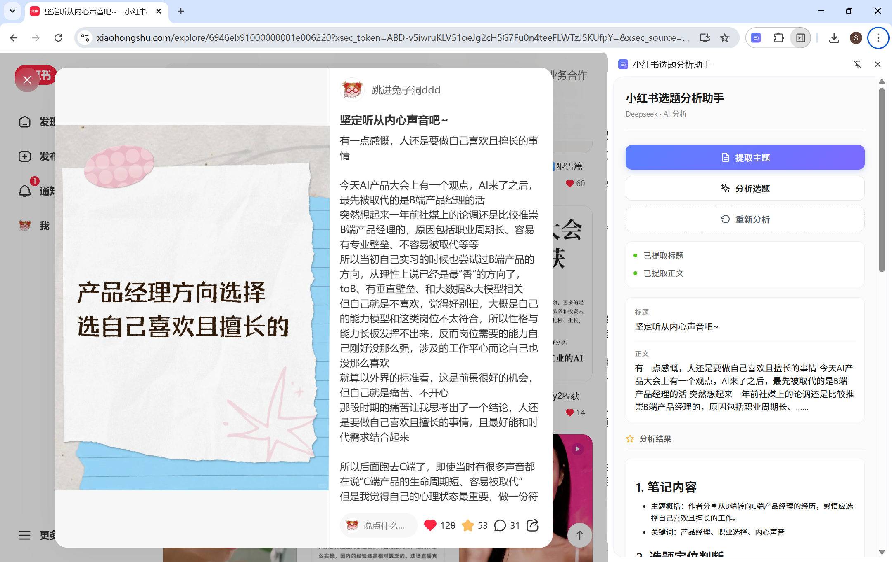
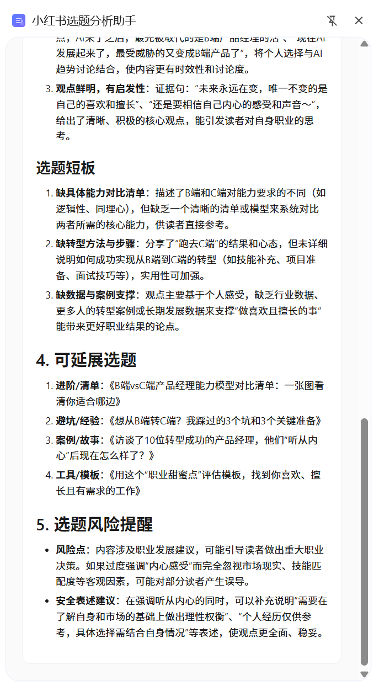
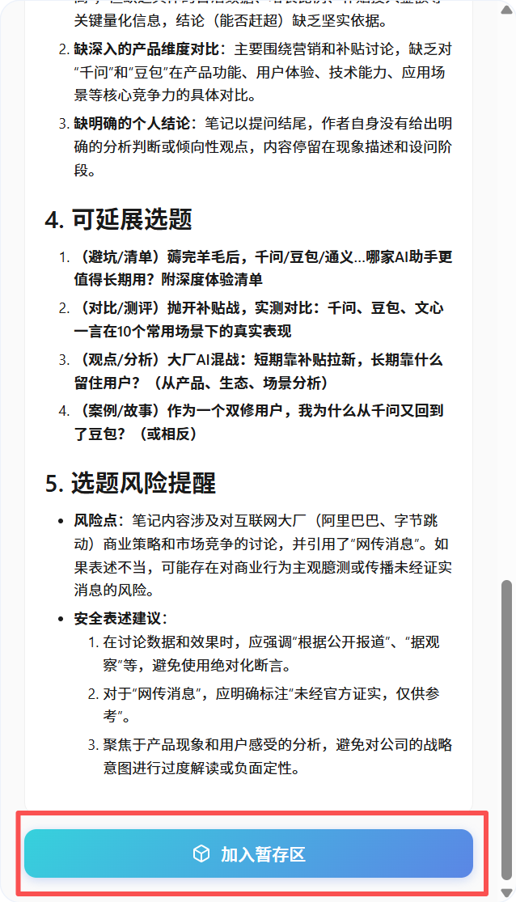
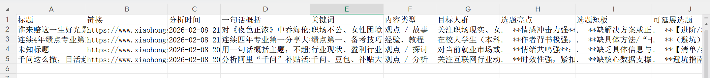

# 小红书选题分析助手

一款专为小红书内容创作者打造的 Chrome 浏览器插件，帮助你快速分析笔记选题的质量与潜力，并支持批量暂存与导出 Excel。

## 这是什么？

当你在小红书网页端浏览笔记时，只需打开这个插件，它就能：

1. **自动提取**笔记的标题和正文内容
2. **智能分析**选题的多个维度，给出专业建议
3. **暂存记录**将分析结果保存到暂存区（上限 100 条）
4. **导出 Excel**批量导出分析结果为 Excel 文件

## 效果展示



<p align="center">
  
  
</p>

<p align="center">
  
  
</p>


## 分析内容

插件会调用 DeepSeek AI 对小红书笔记进行深度分析，输出以下内容：

| 分析维度 | 说明 |
|---------|------|
| **笔记内容** | 一句话概括主题 + 关键词提取 |
| **选题定位** | 内容类型、目标人群、核心需求 |
| **亮点与短板** | 选题的优势和不足之处 |
| **可延展选题** | 基于当前主题的延伸方向建议 |
| **选题风险提醒** | 涉及敏感内容时的风险提示 |

## 暂存区与导出 Excel

### 暂存区

- 分析完成后，点击「加入暂存区」将当前分析结果保存
- 暂存区最多保存 **100 条**记录，使用 `chrome.storage.local` 持久化存储
- 每条记录包含：笔记标题、链接、分析时间、一句话概括、完整分析内容
- 支持查看详情、勾选/取消勾选、删除所选记录

### 导出 Excel

- 在暂存区中勾选要导出的记录，点击导出按钮即可生成 `.xlsx` 文件
- 导出字段包含 11 列：标题、链接、分析时间、一句话概括、关键词、内容类型、目标人群、选题亮点、选题短板、可延展选题、选题风险提醒
- 文件命名格式：`选题分析_YYYYMMDD_x篇笔记.xlsx`

## 适用场景

- 分析爆款笔记的选题逻辑
- 评估自己选题的质量
- 寻找选题的优化方向
- 发现同赛道的延展选题
- 批量收集分析结果，导出 Excel 汇总对比

## 配置 API Key

使用本插件前，需要先配置 DeepSeek API Key：

### 1. 获取 API Key

访问 [DeepSeek 开放平台](https://platform.deepseek.com/)，注册账号并创建 API Key

### 2. 配置到插件

1. 复制 `config.example.js` 文件并重命名为 `config.js`
2. 打开 `config.js`，将 `your-api-key-here` 替换为你的 API Key：

```javascript
const CONFIG = {
  API_URL: 'https://api.deepseek.com/chat/completions',
  API_KEY: 'sk-xxxxxxxxxxxxxxxxxxxxxxxx'  // 填入你的真实 API Key
};
```

3. 保存文件

⚠️ **安全提示**：`config.js` 文件包含敏感信息，已被 `.gitignore` 忽略，不会被提交到 Git 仓库

## 安装步骤

1. 打开 Chrome 浏览器，访问 `chrome://extensions/`
2. 开启右上角的「开发者模式」
3. 点击「加载已解压的扩展程序」
4. 选择本插件文件夹

## 使用方法

1. 在小红书网页端打开任意一篇笔记详情页
2. 点击浏览器工具栏中的插件图标，打开侧边栏
3. 点击「提取主题」按钮，自动获取笔记标题和正文
4. 点击「分析选题」按钮，等待 AI 分析结果
5. 如需重新分析当前页面，点击「重新分析」即可
6. 分析完成后，点击「加入暂存区」保存分析结果
7. 点击右上角下载图标进入暂存区，勾选记录后点击导出按钮下载 Excel

## 文件结构

```
xhs-topic-analyzer/
├── manifest.json       # 插件配置文件
├── background.js       # 后台脚本
├── sidepanel.html      # 侧边栏页面（含分析页、暂存区列表、暂存详情三个视图）
├── sidepanel.js        # 侧边栏逻辑（含暂存区存储、解析、导出功能）
├── styles.css          # 样式文件
├── config.example.js   # API Key 配置模板（需复制为 config.js）
├── config.js           # API Key 配置文件（不提交到 Git）
├── icons/              # 插件图标
├── lib/
│   ├── marked.min.js   # Markdown 解析库
│   └── xlsx.full.min.js # SheetJS Excel 生成库
├── image_preview/      # 效果截图
│   ├── 插件截图1.png
│   ├── 插件截图2.png
│   └── 插件截图3.png
└── README.md           # 说明文档
```
